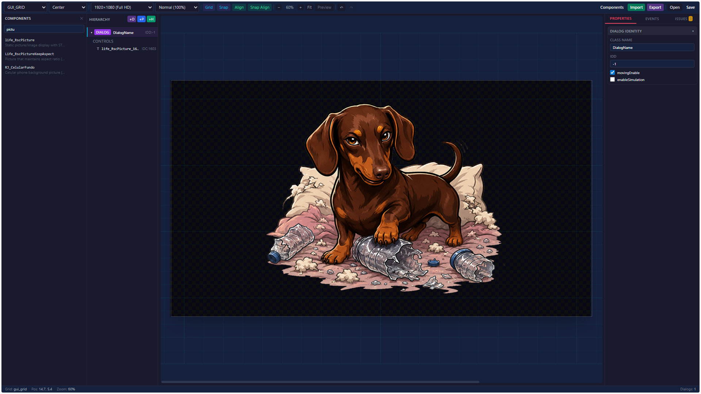

# A3L GUI Editor

A **visual editor** for creating Arma 3 `config.cpp` UI dialogs, designed for Life/RP server frameworks. Build complex layered UIs with a canvas-based editor, real-time preview, full Arma 3 coordinate system support, and a comprehensive component library based on the Arma 3 wiki.

## Screenshot



The editor provides a **three-panel layout**:
- **Left**: Component Library (presets), Hierarchy (dialog tree)
- **Center**: Interactive canvas with drag, resize, zoom, and alignment guides
- **Right**: Properties panel with tabs (Identity, Position, Style Flags, Appearance, Type-Specific, Event Handlers)

---

## Tech Stack

| Layer | Technology |
|-------|-----------|
| Framework | **React 18** + **TypeScript** |
| State Management | **Zustand** (undo/redo history) |
| Build | **Vite** |
| Styling | **Tailwind CSS** (dark theme) |
| Code Editor | **Monaco Editor** (for event handlers) |

## Features

### Core
- **Visual canvas** — Drag, resize, and position UI controls visually
- **Multiple grid systems** — `GUI_GRID` (40×25), `SafeZone`, `Absolute` (legacy), `Pixel Grid`
- **Expression-based coordinates** — Full support for Arma 3 grid expressions like `4.7 * GUI_GRID_CENTER_W + GUI_GRID_CENTER_X`
- **Zoom** — Ctrl+Scroll or Alt+Scroll zoom (0.1× – 10×) with cursor-centered anchoring
- **Full-screen Preview** — F11 or toolbar button to hide all chrome and auto-scale the canvas to fill the viewport
- **Multi-select** — Ctrl+click to select multiple controls, then drag or resize as a group
- **Smart Alignment** — Green guide lines appear when component edges or centers align during drag/resize. Snaps to canvas boundaries, safe zone edges, and other components
- **Layer Reorder** — Right-click → Move Up / Move Down, or drag-and-drop in the Hierarchy panel (last = topmost)
- **Copy/Paste** — Ctrl+C / Ctrl+V to duplicate controls with all properties preserved
- **Duplicate** — Right-click → Duplicate in the Hierarchy panel
- **Undo/Redo** — Ctrl+Z / Ctrl+Y with coalesced history (200ms window)
- **Config generation** — Export to `class`, `full_dialog`, `hud`, or editor format
- **Config import** — Parse existing Arma config files into editable controls
- **Project tabs** — Photoshop-style tabs to switch between open dialogs/displays/HUDs
- **Inheritance** — Controls inherit from parent classes; only explicitly-set properties are emitted in config output
- **ST_PICTURE image support** — Upload PNG preview images; set real Arma `.paa` texture paths

### Component Library — 51 Presets

The component library provides both **Arma 3 native** base classes and **Life/RP framework** presets, exactly matching the Arma 3 wiki defaults:

| Category | Arma Native | Life Framework |
|----------|-------------|----------------|
| **Checkboxes** | `RscCheckbox` | `Life_Checkbox`, `Life_RscCheckbox` |
| **Scrollbars** | — | `Life_RscScrollBar` |
| **Control Groups** | `RscControlsGroup` | `Life_RscControlsGroup`, `Life_RscControlsGroupNoScrollbars` |
| **HUD / Text** | `RscText`, `RscLine`, `RscFrame`, `RscStructuredText` | `Life_RscHud`, `Life_RscText`, `Life_RscLine`, `Life_RscTitle`, `Life_RscTextMulti`, `Life_RscStructuredText`, `Life_RscActiveText` |
| **Lists & Selection** | `RscCombo`, `RscListBox` | `Life_RscListNBox`, `Life_RscListBox`, `Life_RscCombo` |
| **Buttons** | `RscButton`, `RscShortcutButton`, `RscButtonMenu` | `Life_RscButton`, `Life_RscButtonTextOnly`, `Life_RscShortcutButton`, `Life_RscButtonMenu`, `Life_RscShortcutButtonMain` |
| **Visuals & Inputs** | `RscPicture`, `RscPictureKeepAspect`, `RscVideo`, `RscVideoKeepAspect`, `RscEdit`, `RscSlider`, `RscXSliderH` | `Life_RscPicture`, `Life_RscPictureKeepAspect`, `Life_RscProgress`, `Life_RscEdit`, `Life_RscSlider`, `Life_RscXSliderH`, `Life_RscBackground`, `Life_RscTree`, `Life_RscHTML`, `Life_RscHitZones`, `Life_RscMapControl`, `Life_RscToolbox` |

Use the **All / Arma / Life** source tabs to filter components by origin.

### Canvas
- Per-control type rendering (buttons, edit boxes, listboxes, sliders, trees, controls groups, etc.)
- Safe zone overlay with dimmed exterior areas
- Grid overlay with major/minor tick lines
- 8-direction resize handles
- Group bounding box for multi-selection
- Image preview for ST_PICTURE controls
- Controls group (CT_CONTROLS_GROUP) editing with child control isolation

### Properties Panel
- **Identity** — Class name, IDC, type, parent class
- **Position & Size** — X, Y, W, H with expression support, font size
- **Style Flags** — Bitwise flag toggles (ST_CENTER, ST_PICTURE, ST_FRAME, ST_HUD_BACKGROUND, etc.)
- **Appearance** — Font, colors (RGBA with color pickers), shadow, text content, tooltip, URL, fade, access, deletable
- **Texture Path** — Dedicated field for Arma `.paa`/`.jpg` texture paths
- **Type-specific** — Properties unique to each control type (button offsets, listbox row height, slider textures, etc.)
- **Event Handlers** — UI Event Handler picker with Monaco code editor

---

## Getting Started

```bash
# Install dependencies
npm install

# Start development server
npm run dev

# Build for production
npm run build

# Type-check
npx tsc --noEmit
```

## Usage

1. **Create a Dialog** — Click +D (Dialog), +P (Display), or +H (HUD) in the project tabs bar
2. **Add Controls** — Browse the Component Library (All / Arma / Life tabs) or right-click a dialog → Add Control
3. **Position & Size** — Drag controls on the canvas, or edit X/Y/W/H in the Properties panel
4. **Set Properties** — Select a control, edit its properties in the right panel
5. **Layering** — Controls in `ControlsBackground` render below `Controls`. Use Move Up/Down or drag-and-drop in the Hierarchy to reorder
6. **Preview** — Press F11 to see the dialog at the selected resolution in full-screen
7. **Export** — Click Export to generate `config.cpp` output

### Keyboard Shortcuts

| Shortcut | Action |
|----------|--------|
| Ctrl+Click | Toggle multi-select |
| Delete / Backspace | Remove selected controls |
| Ctrl+C | Copy selected controls |
| Ctrl+V | Paste copied controls |
| Ctrl+Z | Undo |
| Ctrl+Y / Ctrl+Shift+Z | Redo |
| Arrow keys | Nudge selected controls (hold Ctrl for fine nudge) |
| Ctrl+Scroll / Alt+Scroll | Zoom in/out (cursor-centered) |
| F11 | Toggle full-screen preview |
| Escape | Exit preview / Clear selection |

## Coordinate Systems

| System | Range | Description |
|--------|-------|-------------|
| `GUI_GRID` | 0–40 (X), 0–25 (Y) | Standard Arma 3 safezone grid with 8 variants (Center, TopLeft, BottomRight, etc.) |
| `SafeZone` | 0–1 relative to safe zone | Normalized coordinates within the safe zone |
| `Absolute` | 0–1 relative to screen | Legacy absolute screen coordinates |
| `Pixel Grid` | 5px increments | Pixel-aligned grid |

## Default Component Sizing

Newly placed components start at `x: 0.25, y: 0.25` with default size `w: 0.5, h: 0.5` (in the current grid system). Resize handles at all 8 edges allow precise adjustment.

## Project Structure

```
src/
├── App.tsx                            # Root layout: toolbar, tabs, 3-panel + status bar
├── main.tsx                           # Entry point
├── components/
│   ├── Canvas/
│   │   ├── Canvas.tsx                 # Main canvas: drag, resize, zoom, pan, alignment
│   │   ├── ControlRenderer.tsx        # Per-type control rendering
│   │   ├── SelectionOverlay.tsx       # Selection handles + group bounding box
│   │   ├── GridOverlay.tsx            # Grid lines overlay
│   │   ├── AlignmentGuideOverlay.tsx  # Green alignment guide lines
│   ├── Toolbar/
│   │   └── Toolbar.tsx                # Top bar: grid, zoom, snap, export, project
│   ├── TabBar/
│   │   └── TabBar.tsx                 # Photoshop-style project tabs
│   ├── HierarchyPanel/
│   │   └── HierarchyPanel.tsx         # Left sidebar: dialog/control tree + context menu
│   ├── PropertiesPanel/
│   │   ├── PropertiesPanel.tsx        # Right sidebar: tabbed property editor
│   │   ├── IdentitySection.tsx        # Class name, IDC, type, parent
│   │   ├── PositionSection.tsx        # X, Y, W, H, grid system
│   │   ├── StyleFlagsSection.tsx      # Bitwise style flags
│   │   ├── AppearanceSection.tsx      # Font, colors, shadow, text, images
│   │   ├── TypeSpecificSection.tsx    # Control-type-specific properties
│   │   └── EventHandlersSection.tsx   # UI Event Handlers
│   ├── ComponentLibrary/
│   │   └── ComponentLibrary.tsx       # Left panel: Arma/Life preset browser + search
│   └── ImportExportModal/
│       └── ImportExportModal.tsx      # Modal for config import/export
├── store/
│   └── editorStore.ts                 # Zustand store: all state + actions
├── types/
│   └── controls.ts                    # TypeScript interfaces for all 28 control types
├── utils/
│   ├── gridUtils.ts                   # Coordinate conversion, safe zone, grid math
│   ├── alignmentUtils.ts              # Smart alignment detection engine
│   ├── styleUtils.ts                  # Style flag helpers, color utilities
│   ├── configGenerator.ts             # Arma config.cpp generation
│   ├── configParser.ts                # Arma config.cpp parsing
│   ├── validation.ts                  # Control validation rules
│   ├── projectSerializer.ts           # Project file save/load
│   └── copyUtils.ts                   # Clipboard helpers
└── data/
    ├── componentLibrary.ts            # 51 presets (18 Arma native + 33 Life framework)
    ├── controlDefaults.ts             # CT_* type metadata
    ├── gridVariants.ts                # GUI_GRID variant definitions
    ├── uiehDefinitions.ts             # UI Event Handler definitions
    └── fontList.ts                    # Available fonts
```

## Control Inheritance

Controls use Arma 3's class inheritance system. For example:

```cpp
class CellphoneBackground : RscPicture {
    style = ST_PICTURE;
    text = "textures\phone\phone.paa";
    x = safeZoneX + safeZoneW * 0.625;
    y = safeZoneY + safeZoneH * 0.217;
    w = safeZoneW * 0.168;
    h = safeZoneH * 0.583;
};
```

Then in dialogs:
```cpp
class Fundo : CellphoneBackground {
    idc = 15019;
    // Inherits all properties from CellphoneBackground
};
```

The editor supports this: when a parent class is set, only **explicitly-modified properties** are emitted in the export, producing clean, inheritance-based config output.

Both **Arma native** (e.g., `RscButton`, `RscText`) and **Life framework** (e.g., `Life_RscButton`, `Life_RscText`) base classes are available in the component library.

## Layering

In Arma 3, the render order is determined by:

1. **Zone order**: `ControlsBackground` → `Controls` → (objects)
2. **Definition order within a zone**: later = on top

The Hierarchy panel shows controls in their definition order. Use **Move Up / Move Down** (right-click) or **drag-and-drop** to reorder.

For a phone UI with wallpaper + frame:
```cpp
class ControlsBackground
{
    class Wallpaper : life_RscPicture { ... };  // bottom layer
};
class Controls
{
    class Frame : life_RscPicture { ... };      // on top of wallpaper
    class Button : life_RscButton { ... };       // topmost, clickable
};
```

## Textures / Images

For controls with `ST_PICTURE` (style 0x30):
1. **Upload PNG** — Loads an image for **canvas preview only** (stored as `imageDataUrl`)
2. **Texture Path** — Type the actual Arma path (e.g., `textures\phone\phone.paa`) in the dedicated field

## Development

### Adding a new control type

1. Add it to `CONTROL_TYPES` in `src/data/controlDefaults.ts`
2. Add a render branch in `ControlRenderer.tsx`
3. Add default properties in the appropriate section
4. If it's a new preset, add it to `src/data/componentLibrary.ts` under either `ARMA_PRESETS` or `LIFE_PRESETS`

### Adding a style flag

Add it to `STYLE_FLAGS` in `src/utils/styleUtils.ts` with the flag value, name, constant, description, and applicable types.

### Adding a grid variant

Add it to `GUI_GRID_VARIANTS` in `src/data/gridVariants.ts` with X/Y/W/H expressions.

---

## Credits

Developed and maintained by **[@Rescker](https://github.com/Rescker)** — Arma 3 Life/RP UI modding tools for the community.
